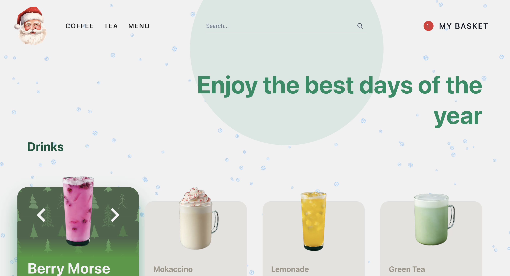
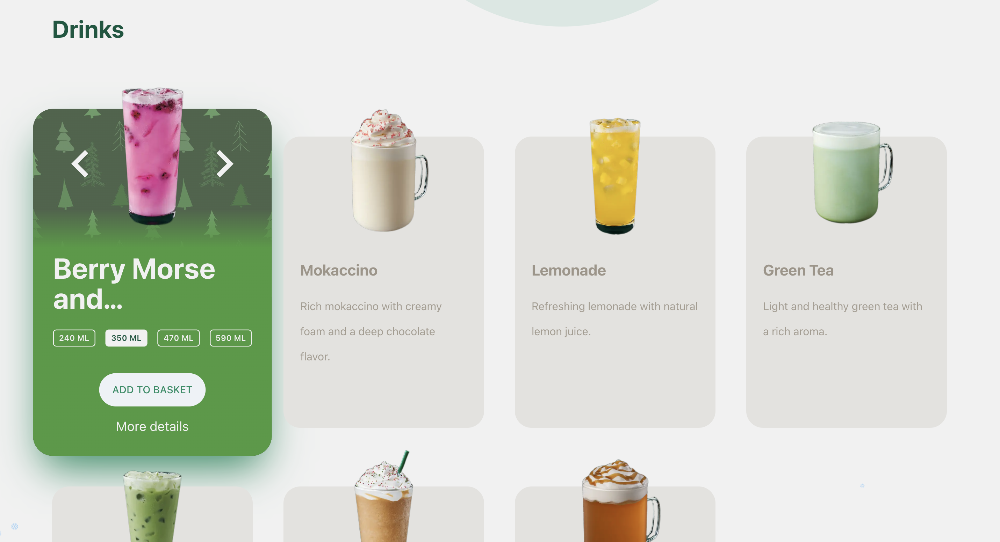
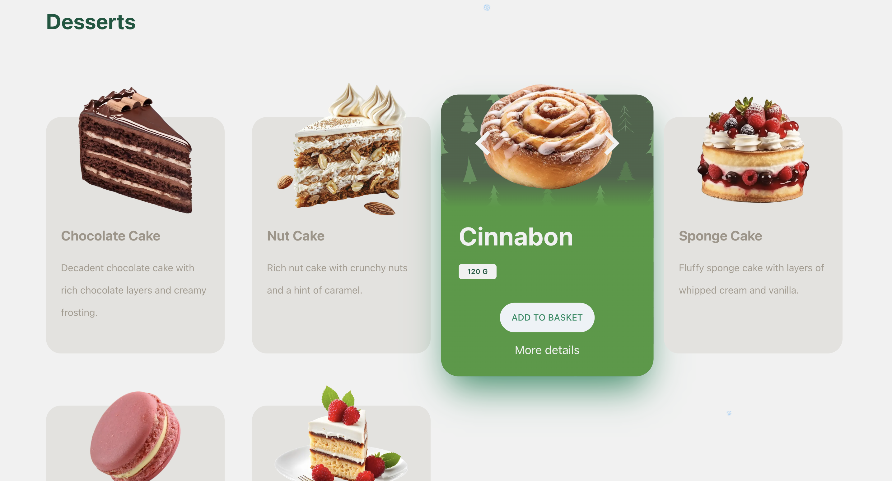
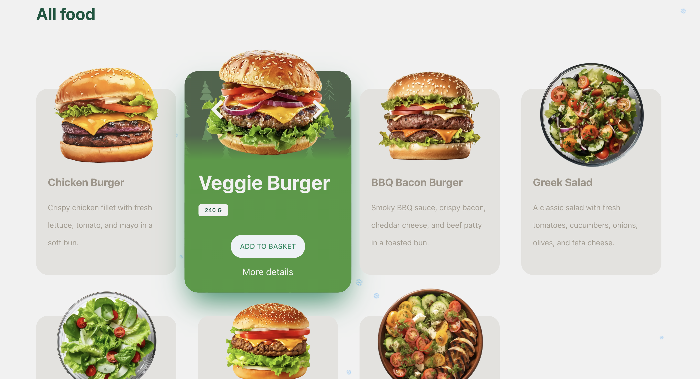
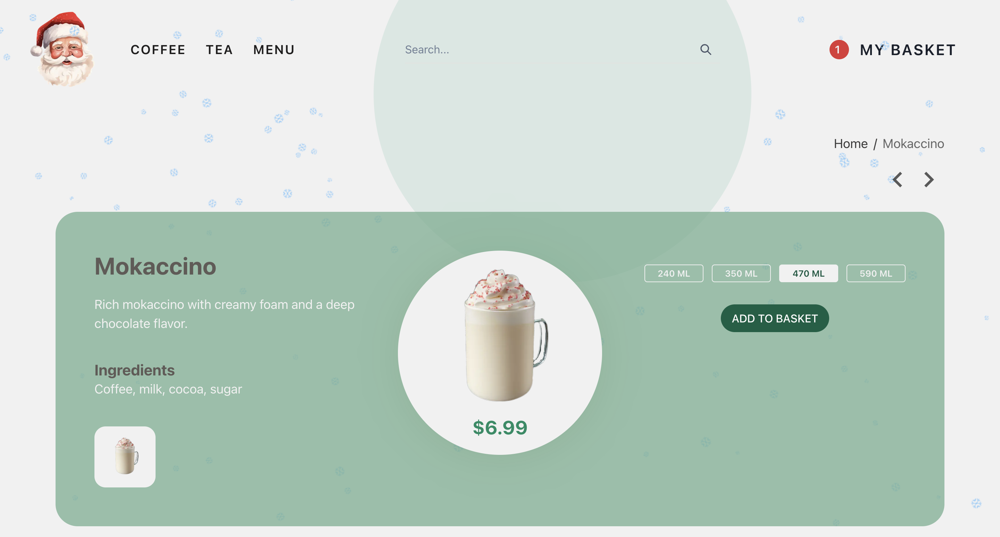
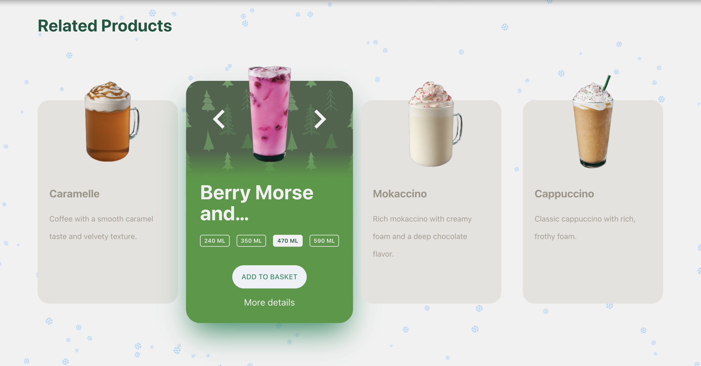
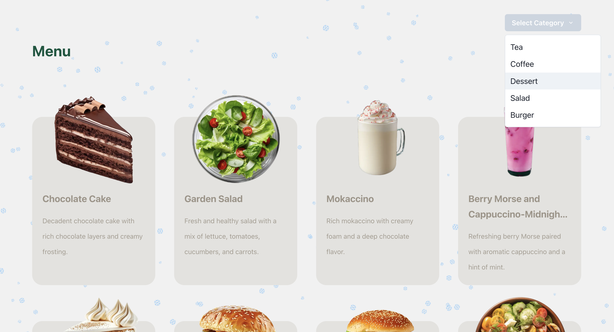
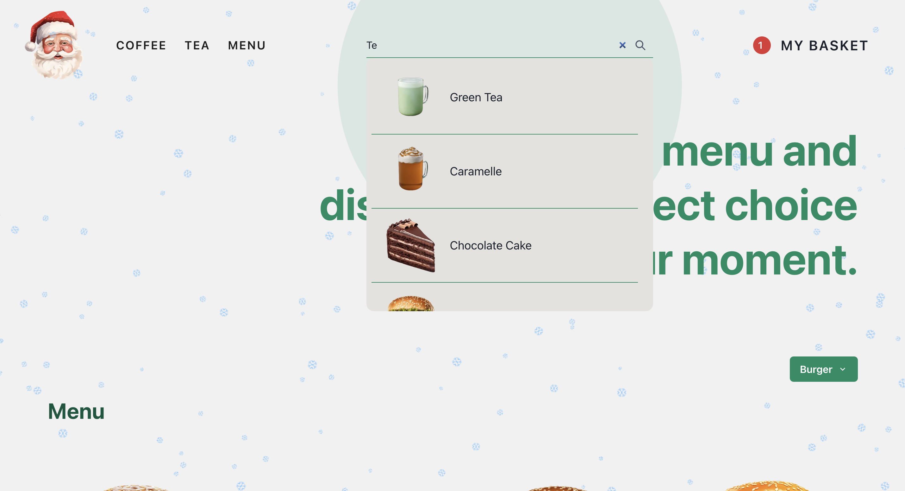
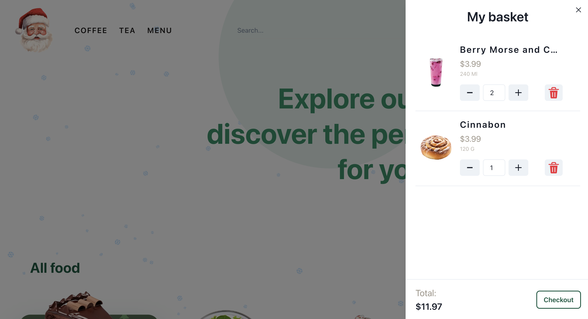

# E-commerce-App
NextJS, NestJS, Prisma, PostgreSQL

## Contents
1. [Main Information](#📜-Main-Information)
2. [Stack](#Stack)
3. [Installation and Usage](#Installation-and-Usage)
4. [Examples](#Examples)
    1. [Home](#Home)
    2. [Single item](#Single-item)
    3. [Filter items](#Filter-items)
    4. [Search](#Search)
    5. [Cart](#Cart)
    6. [Contacts](#Contacts)

____

## 📜 Main Information

____

## Stack

### Client stack

✅ TypeScript

✅ NextJS

✅ ReduxJS

✅ Redux Persist

✅ React Query

✅ Axios

✅ Chakra UI

✅ Tailwind CSS

### Server stack

✅ TypeScript

✅ NestJS

✅ Axios

✅ Prisma

✅ PostgreSQL

____

## Installation and Usage

The project consists of two parts: the server and the client.

**Installation:**

* Clone the repository: git clone https://github.com/reyand8/E-commerce-App.git

**Usage:**

* Server
    - Navigate to the server directory: cd server
    - Install dependencies: npm install
    - Generate fake products: npm run seed
    - Run the server: npm run start:dev
    - Server will run on http://localhost:5001
* Client
    - Navigate to the project directory: cd client
    - Install dependencies: npm install
        - Run the project: npm run dev
        - Open a browser and navigate to: http://localhost:3000
      

____

## Examples

### Home

____
____

### Single item

____
____

### Filter items

____
____

### Search

____
____

### Cart

____
____

### Contacts

